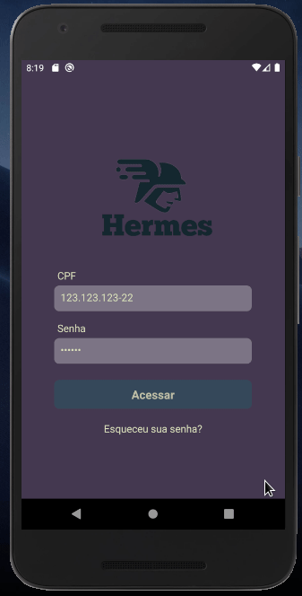
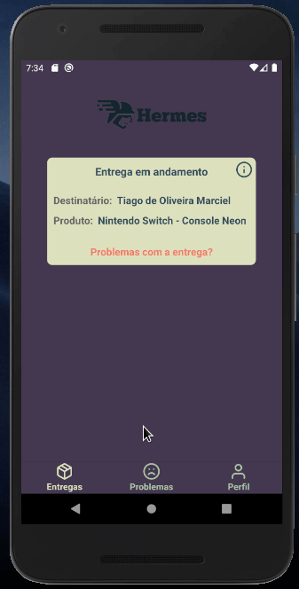

<h1 align="center">Hermes</h1>

Hermes is a android aplication for managemento of delivery packs.</h1>

  
  <a aria-label="React Version" href="https://github.com/facebook/react-native">
    </img>
  </a>
  <a aria-label="Github API" href="https://github.com/mycatdoitbetter/hermes-backend">
    </img>
  </a>

<table border="0" align="center"> 
  <tr align="center">
     <td><b style="font-size:23px">Login and password recovery</b></td>
     <td><b style="font-size:23px">App main navigation</b></td>
     <td><b style="font-size:23px">Recording pack problems</b></td>
  </tr>
  <tr align="center">
    <td>
      

        
       

     </td>
     <td>
       

        
       

     </td>
     <td>
      

        
       

     </td>
  </tr>
 </table>

